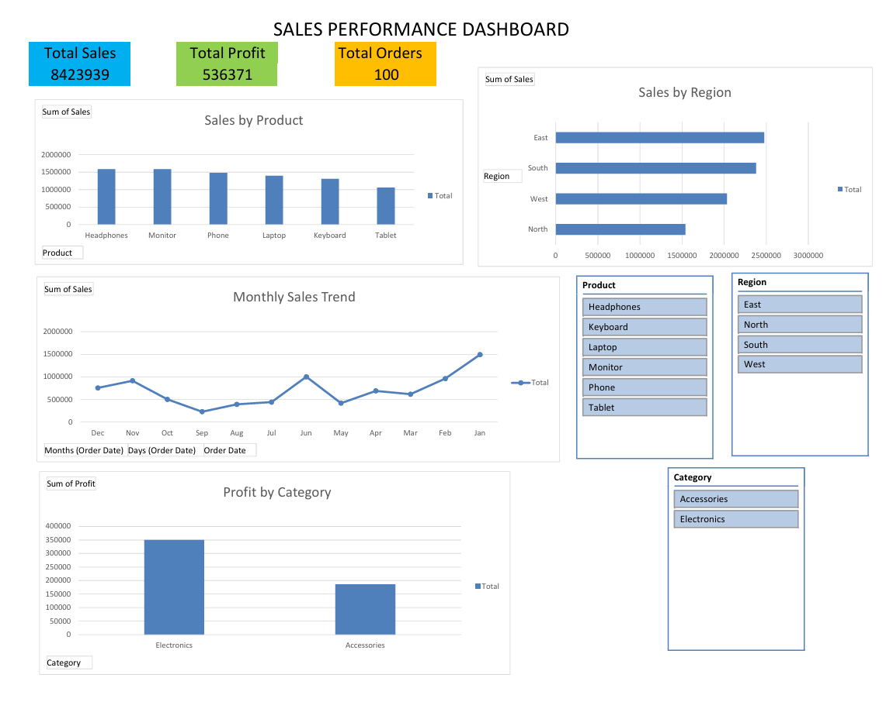

# Sales Performance Dashboard (Excel)

## Project Overview
This project analyzes a dataset of **5,200 sales transactions** to identify product performance, regional sales trends, and monthly revenue patterns.  
The dashboard was built using **Microsoft Excel Pivot Tables, Charts, and Slicers** to create an interactive sales analysis tool.

The goal of this project is to demonstrate **data cleaning, data analysis, and dashboard creation skills using Excel**.

---

## Dataset Information

The dataset contains **5,200 sales records** with the following fields:

| Column | Description |
|------|-------------|
| Order_ID | Unique identifier for each order |
| Order_Date | Date when the order was placed |
| Product | Product sold |
| Category | Product category (Electronics / Accessories) |
| Region | Sales region (North, South, East, West) |
| Quantity | Number of units sold |
| Price | Price per unit |
| Sales | Total revenue generated (Quantity × Price) |
| Profit | Profit earned from the sale |

---

## Tools Used

- Microsoft Excel
- Pivot Tables
- Pivot Charts
- Slicers
- Data Cleaning
- Data Visualization

---

## Dashboard Features

The dashboard provides the following analysis:

### Key Performance Indicators (KPIs)
- Total Sales
- Total Profit
- Total Orders

### Visualizations
1. **Sales by Product**  
   Shows which products generate the most revenue.

2. **Sales by Region**  
   Compares sales performance across geographic regions.

3. **Monthly Sales Trend**  
   Displays how sales change over time.

4. **Profit by Category**  
   Highlights which product categories generate the most profit.

### Interactive Filters
The dashboard includes slicers that allow filtering by:
- Product
- Region

This allows users to interactively explore the sales data.

---

## Key Insights

- Laptop and Phone products generate the highest revenue.
- East and South regions contribute the largest share of total sales.
- Sales show monthly fluctuations indicating seasonal demand.
- Electronics products contribute the majority of overall profit.

---

## Dashboard Preview

---

## Project Structure
